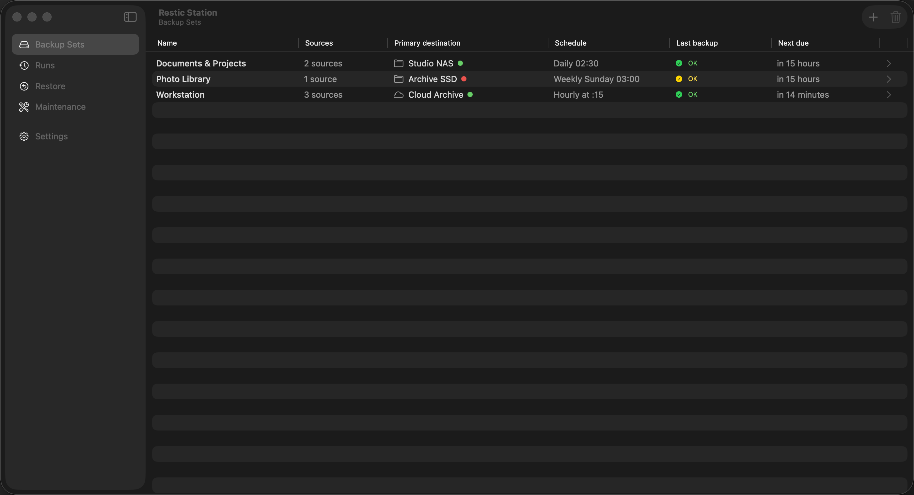
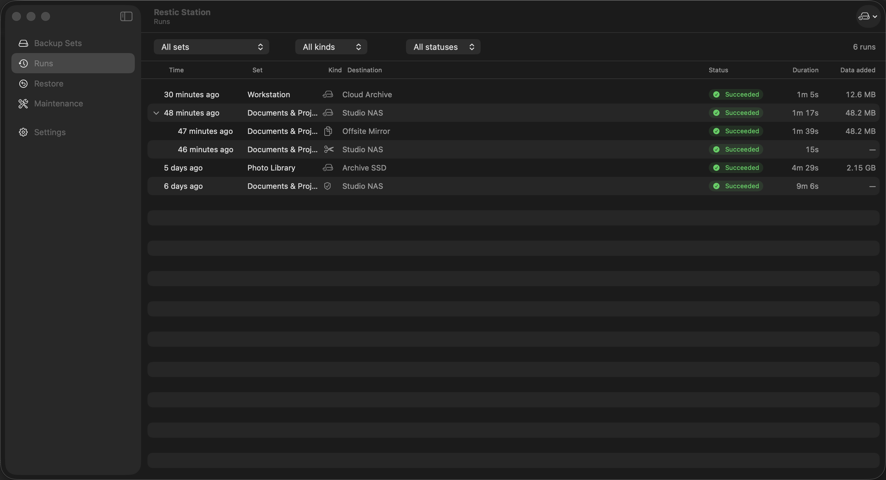

# Restic Station

Scheduling and management for [restic](https://restic.net) backups: a native macOS menu bar app, plus a cross-platform CLI (`restic-station-helper`) that runs the exact same backup engine headless on Linux. Author backup sets in the Mac app, move the config to a Linux box (NAS, VPS, home server), and it keeps backing up unattended — see [`docs/linux.md`](docs/linux.md).

**Status: feature-complete, pre-release.** All planned functionality is implemented and CI-tested (including an integration suite against real restic on both platforms); signed releases are not yet published — install from a CI build or build from source (below).

## What it does

- **Backup Sets** — a named set of local source directories backed up to one **primary** restic repository, mirrored to any number of **secondary** repositories via `restic copy` (content-verified, add-only: a prune, deletion, or corruption of the primary is never propagated to a mirror). Secondaries may be offline (e.g. an unplugged external drive) — they are skipped gracefully, tracked for staleness, and caught up in full the next time they appear.
- **Schedules** — hourly / daily / weekly / every-N-minutes per set, executed by a headless helper under `launchd`. Backups run even when the app is closed, and runs missed while the Mac slept happen on wake (anacron-style).
- **Runs** — full history of every backup / copy / check / prune with live progress, stats, and logs; "Back Up Now" manual trigger.
- **Restore** — browse or search snapshots of any destination, restore selected paths with overwrite warnings, or mount a snapshot read-only (optional, requires [macFUSE](https://macfuse.github.io)).
- **Maintenance** — retention policies (`restic forget --prune`), repository statistics, and scheduled integrity checks (`restic check --read-data-subset` slice rotation).

## A look at the app

| Backup sets and destination health | Grouped backup, mirror, and maintenance history |
|---|---|
|  |  |

Restic Station wraps an off-the-shelf restic binary already installed on the system (e.g. `brew install restic`) — it never bundles or manages restic itself.

## Requirements

**macOS app:**
- macOS 14 (Sonoma) or later
- restic ≥ 0.18 on the system (`brew install restic`)
- Xcode 15+ and [XcodeGen](https://github.com/yonaskolb/XcodeGen) to build from source

**Linux (headless CLI):**
- x86_64 or aarch64; no particular distro or glibc version required (statically linked, see [Linux (headless)](#linux-headless) below)
- restic ≥ 0.17.0 (0.18+ recommended) **on `PATH` or at an explicit `resticPath`** — most distro packages are too old (Ubuntu 24.04 LTS ships 0.16.4); see [`docs/linux.md`](docs/linux.md#prerequisites)

## Installing (macOS)

Until signed releases exist, grab a CI build: open any green run on the [Actions page](../../actions), download the **Restic-Station-app** artifact, then:

```sh
unzip Restic-Station-app.zip
xattr -dr com.apple.quarantine "Restic Station.app"   # CI builds are ad-hoc signed
mv "Restic Station.app" /Applications/
```

Running from `/Applications` matters: the background agent (SMAppService) and Full Disk Access attribution bind to the app's path.

### First-run setup

1. Launch the app and follow onboarding: pick your restic binary (auto-discovered from `/opt/homebrew/bin/restic`), register the background agent (approve it under **System Settings → General → Login Items & Extensions** if asked).
2. Grant **Full Disk Access**: System Settings → Privacy & Security → Full Disk Access → add **Restic Station**. There is no prompt for this — macOS requires you to do it manually, and backups of Mail/Safari/Messages data silently fail without it. Onboarding shows two badges (**App** and **Background agent**) and both must go green; if the agent badge stays denied, see the [troubleshooting section](docs/keychain-and-fda.md#troubleshooting-from-t11t18-implementation-evidence).
3. Create a Backup Set: sources, a primary repository (with password — stored in your Keychain), optional mirrors, a schedule, and a retention policy.

## Command line

Restic Station is GUI **and** CLI. The tool itself ships embedded inside the app bundle at `Restic Station.app/Contents/MacOS/restic-station-helper` — install a friendly `restic-station` symlink on your `PATH` and use that instead of typing the bundle path:

```sh
"/Applications/Restic Station.app/Contents/MacOS/restic-station-helper" cli install --user   # ~/.local/bin, no sudo; drop --user for /usr/local/bin
restic-station status                      # once installed — or skip this step entirely via Settings → General → Command line, Install button
```

(`restic-station-helper` is not on `PATH` yet at this point — creating that first `PATH` entry is what this step does, so it has to be run by its full in-bundle path once. Every command after this one uses the short name.)

`cli install` always creates a **symlink**, never a copy — the embedded binary's location matters (it's what `SMAppService` registration and Full Disk Access attribution bind to; see [`docs/keychain-and-fda.md`](docs/keychain-and-fda.md)), and a symlink is transparent to both because the kernel resolves it before anything runs. `cli status` reports whether it's installed and where it points; `cli uninstall` removes it. All three are idempotent and refuse to touch a file at the target path that isn't one of their own symlinks. The same install/uninstall is one click away in **Settings → General → Command line**.

A few representative commands once installed:

```sh
restic-station status --json          # headless equivalent of the menu bar; exit 1 if any set needs attention
restic-station sets list              # configured backup sets on this machine
restic-station runs list --limit 20   # recent run history
restic-station config show --json     # effective, per-machine-resolved configuration
```

Run `restic-station --help` for the full subcommand list (`config`, `status`, `sets`, `runs`, `secret`, `cli`, and the mutating commands `tick`/`run-set`/`restore`/… that the app and the background agent use themselves). Out of scope for now: a Homebrew formula, man pages, and shell completions (ArgumentParser can generate the last one cheaply — see the open follow-up issue if you want to pick it up).

## Building from source

```sh
brew install xcodegen restic
./scripts/bootstrap.sh        # runs xcodegen generate
open ResticStation.xcodeproj  # or: xcodebuild -scheme "Restic Station" build
swift test --package-path Core
```

> **Note:** background-agent (SMAppService) and Full Disk Access behavior can only be tested with the app copied to `/Applications` — see [`docs/keychain-and-fda.md`](docs/keychain-and-fda.md).

For a repeatable clean-machine release check, manually run **macOS Release
Verification** on the [Actions page](../../actions). It builds and installs the
Release app on a standard hosted `macos-15` runner, exercises real disposable
backup/restore and CLI flows, and retains the verified bundle plus evidence.
The exact coverage and persistent-Mac boundaries are documented in
[`docs/macos-release-verification.md`](docs/macos-release-verification.md).

## Linux (headless)

There is no GUI on Linux — `restic-station-helper` is the whole product: scheduling (`timer install`, a `systemd --user` timer), the `config`/`status`/`sets`/`runs`/`secret` CLI, and the same backup engine as the Mac app underneath. A statically-linked binary (no Swift runtime, no libc, no ICU — verified to run unmodified in a `scratch` container) is published for `x86_64` and `aarch64` on every green CI run: open any run on the [Actions page](../../actions), download the **restic-station-linux** artifact, then:

```sh
tar xzf restic-station-linux-x86_64.tar.gz   # or -aarch64
cd restic-station-linux-x86_64
./install.sh                                 # ~/.local/bin, no root needed
```

See the tarball's own `README.md` for first-run setup (moving a `config.json` authored on the Mac app over, `secret set`, `timer install`), and `docs/testing.md` for exactly how the static build is produced and verified. Building it yourself from a clean checkout (macOS, cross-compiling with Apple's Static Linux SDK — no Linux machine or container runtime needed):

```sh
scripts/package-linux.sh   # installs its own pinned toolchain/SDK (no sudo), builds + packages
                            # x86_64 and aarch64 into dist/restic-station-linux-<arch>.tar.gz
```

## Architecture

Three components (full detail in [`docs/architecture.md`](docs/architecture.md)):

| Component | Platform | Role |
|---|---|---|
| `ResticStationCore` (Swift package) | macOS + Linux | All logic: config, restic process runner + JSON parsers, schedule math, run store, backup engine. Fully unit-testable. |
| `restic-station-helper` (CLI) | macOS + Linux | The single code path for all mutating restic operations. Embedded in the app bundle on macOS (invoked by `launchd` every 2 minutes in `tick` mode, by the app for manual actions, and directly via the `restic-station` `PATH` symlink — see [Command line](#command-line)); a standalone static binary on Linux, invoked by a `systemd --user` timer (see [Linux (headless)](#linux-headless)). |
| `Restic Station.app` (SwiftUI) | **macOS only** | Menu bar status + management window (sets, runs, restore, maintenance, settings). On Linux the helper's CLI is the whole product — there is no GUI. |

Repository passwords and secret environment variables (e.g. S3 keys) live in the macOS Keychain; on Linux (and on macOS if forced) they live in a mode-`0600` `secrets.json` instead. Never in `config.json`. See [`docs/keychain-and-fda.md`](docs/keychain-and-fda.md) for how both backends work.

## Documentation

| Doc | Contents |
|---|---|
| [architecture.md](docs/architecture.md) | Components, process model, invariants, error taxonomy |
| [linux.md](docs/linux.md) | End-to-end Linux headless setup: install, move a config over, secrets, scheduling, troubleshooting |
| [data-model.md](docs/data-model.md) | Config / state / run-record schemas with examples, incl. per-machine overrides |
| [restic-cli.md](docs/restic-cli.md) | Exact restic invocations, exit codes, captured `--json` output fixtures |
| [scheduling.md](docs/scheduling.md) | Tick model, due-computation rules, locking, staleness (both platforms) |
| [keychain-and-fda.md](docs/keychain-and-fda.md) | Keychain ACL strategy (macOS), file secret store (Linux), Full Disk Access / TCC, SMAppService gotchas |
| [ui-spec.md](docs/ui-spec.md) | Screen-by-screen UI specification — **macOS app only** |
| [testing.md](docs/testing.md) | Test strategy, fakes, fixtures, integration script contract, CI job table |
| [tasks/](docs/tasks/) | The implementation task breakdown (mirrored as GitHub issues) |

## FAQ

**Why does the app need Full Disk Access?**
Restic reads your files directly, and macOS blocks access to Mail, Safari, Messages, and similar data without FDA — with no prompt, just silent failures. The file-picker permission the app gets when you choose sources doesn't extend to the background helper that actually runs scheduled backups, so FDA is effectively required for real backups. Details: [docs/keychain-and-fda.md](docs/keychain-and-fda.md).

**Where are my repository passwords stored?**
In your login Keychain (service `restic-station`), never in config files. They're written and read via Apple's `/usr/bin/security` tool so that headless scheduled backups can read them without a GUI consent prompt. One accepted tradeoff: when saving a password, it is momentarily visible in the local process list.

**Why is my mirror marked stale?**
A mirror only advances when a `restic copy` from the primary succeeds. If the mirror's drive was unplugged (or a copy failed), it's skipped gracefully and its "last synced" age grows — that's the staleness badge. Plug the drive back in; the next run catches it up in full. Mirrors are add-only: damage or pruning on the primary is never propagated to them.

**What happens when my external drive is unplugged?**
Nothing bad. Backups to the primary continue; the offline mirror is skipped (no error spam), tracked for staleness, and fully caught up next time it's connected. Retention is never applied to a mirror that isn't caught up.

**Note for this build:** applying retention *manually* is currently unavailable while exact-plan authorization is completed (issues #111 and #82). Retention still runs after each successful backup and copy — whether the backup was scheduled or started by hand — so repositories do not grow without bound; cleanup is deferred to the next backup run rather than removed. (One exception: retention only follows a *successful* backup, so a repository whose backups are failing — a full volume, say — receives no retention either; free space there by hand with `restic forget --keep-last <n> --prune`.) Previewing cleanup is read-only and still available.

**Do backups run when the app is closed / the Mac was asleep?**
Yes. A `launchd` agent runs the helper every 2 minutes independent of the app; schedules missed during sleep run within ~2 minutes of wake (anacron-style).

**Can I run backups on Linux without the Mac app?**
Yes. Building/authoring a config in the Mac app first is the easiest path (nothing to hand-write), but it's not required — `config.json` is a plain, documented JSON file (`docs/data-model.md`) you can write by hand and `config import` on the Linux box. The Mac app is never required at runtime; a fleet of Linux-only hosts with no Mac anywhere is a supported setup.

**Does one config work across machines?**
Yes, by design — `config.json` is the one file meant to be shared (checked into a private repo, rsynced, whatever you like). Per-machine differences (which sets run here, which sources/schedule/repo URL to use, offline-only mirrors) are expressed as `machines` overrides keyed on a `machineId`, not as separate files. See `docs/data-model.md` §Per-machine scoping and `docs/linux.md`.

**Why isn't there a Linux GUI?**
The two things a GUI mainly buys — visual set editing and a menu bar status icon — matter most on the machine where you're actively working, which for this project's target Linux hosts (NAS, VPS, headless server) is never true. The CLI (`config`, `status`, `sets`, `runs`, `secret`) covers the same ground non-interactively, and it's the same code either way: no separate Linux logic to keep in sync with a GUI that doesn't exist.

**Are repos interchangeable between macOS and Linux?**
Yes — a restic repository doesn't know or care what created it. A repo initialized from the Mac app can be backed up to, restored from, checked, and pruned from a Linux host and vice versa; that interchangeability is the whole point of "author on the Mac, run on Linux." What is *not* interchangeable is `machine.json` (host identity — never copy it between machines) or a stored secret (each host's `secrets.json`/keychain is populated independently via `secret set`).

**Where are passwords stored on Linux, and why not the keyring?**
A mode-`0600` file, `secrets.json`, under the state directory — never in `config.json`. The target hosts are headless (no desktop session, no D-Bus user bus, no keyring daemon), so a `gnome-keyring`/`kwallet`/`pass`-style solution would depend on infrastructure that doesn't exist there, which is exactly the kind of hidden dependency that makes a 3am scheduled backup silently fail. See `docs/keychain-and-fda.md` §5 for the full threat model — it's a narrower guarantee than the macOS Keychain's, and that's stated rather than papered over.

## License

[MIT](LICENSE)
